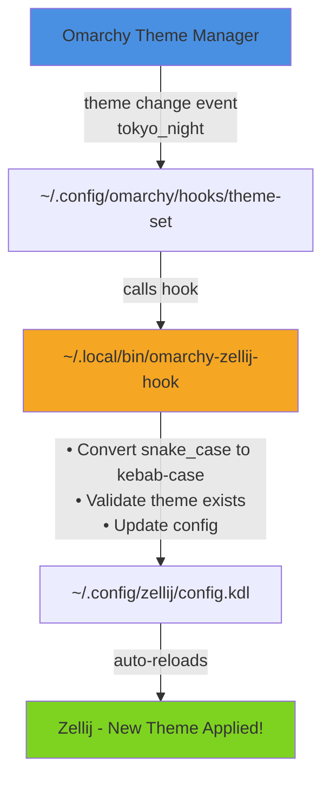
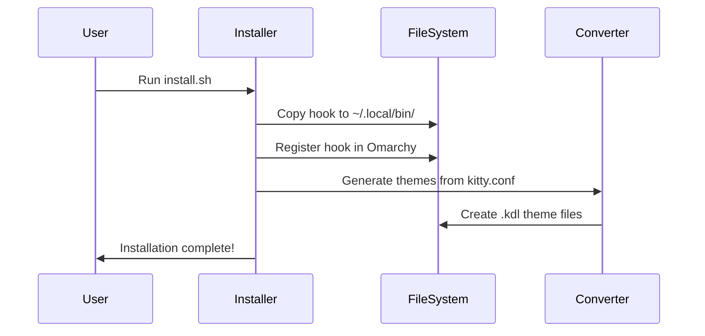
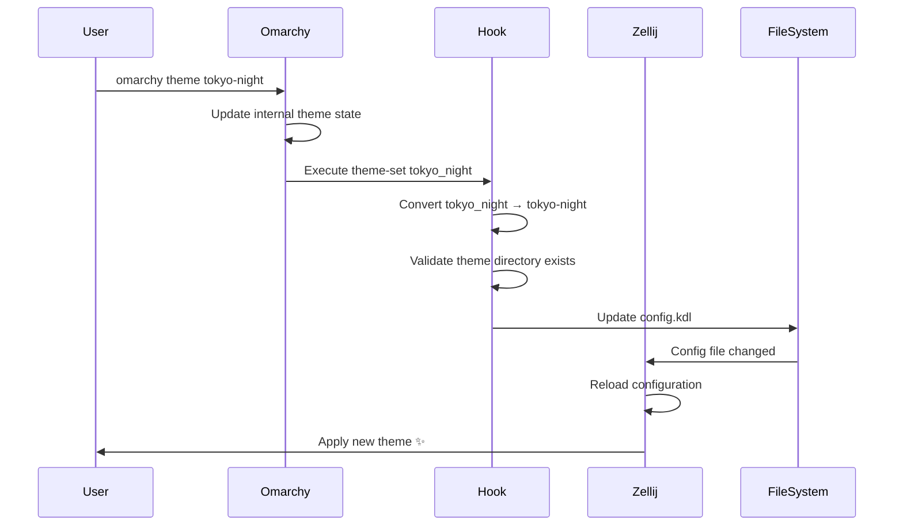
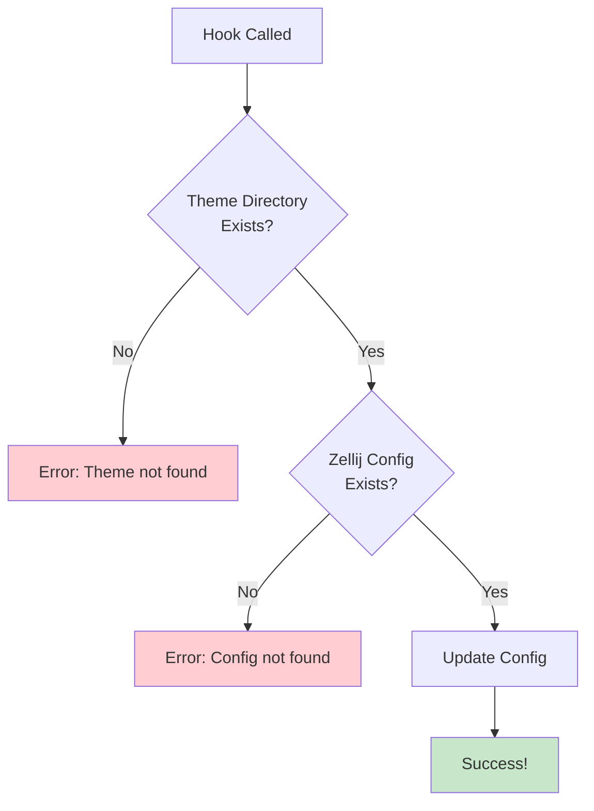
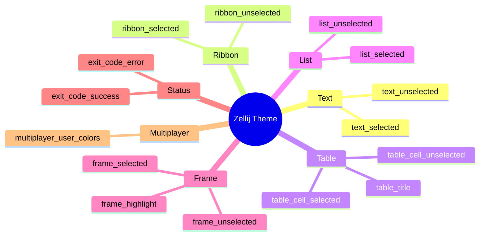
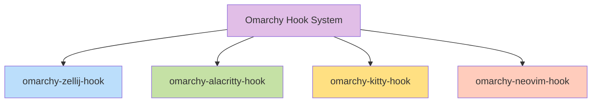

# How It Works

This document explains the technical architecture and inner workings of omarchy-zellij.

## Architecture Overview



## Components

### 1. Omarchy Hook System

Omarchy provides a hook system that allows external scripts to respond to events. Hooks are shell scripts placed in `~/.config/omarchy/hooks/`.

When you run `omarchy theme tokyo-night`, Omarchy:
1. Changes its internal theme state
2. Executes `~/.config/omarchy/hooks/theme-set tokyo_night`
   - Note: theme name is passed in **snake_case** (underscores)

### 2. The Hook Script (`omarchy-zellij-hook`)

Located at `~/.local/bin/omarchy-zellij-hook`, this bash script handles the theme synchronization.

**Key operations:**

1. **Name conversion:** `tokyo_night` → `tokyo-night`
   - Uses bash parameter expansion: `${THEME_SNAKE//_/-}`
   
2. **Validation:** Ensures theme directory exists
   - Prevents errors from typos or missing themes
   
3. **Config update:** Uses `sed` to replace the theme line
   - Updates the `theme` directive in Zellij's config.kdl

### 3. The Theme Converter (`convert_theme.py`)

This Python script converts Omarchy's kitty.conf color definitions to Zellij's KDL format.


**Input (kitty.conf):**
```conf
foreground #D8DEE9
background #2E3440
color0  #3B4252  # black
color1  #BF616A  # red
```

**Output (Zellij KDL):**
```kdl
themes {
    nord {
        text_unselected {
            base 216 222 233
            background 46 52 64
            # ... more attributes
        }
    }
}
```

### 4. Zellij Auto-Reload

Zellij watches its config file for changes. When modified:

1. **Detects change:** inotify (Linux) or similar mechanism
2. **Validates config:** Ensures KDL syntax is correct
3. **Reloads theme:** Applies new colors to all panes
4. **Updates UI:** All visible elements update instantly

## Data Flow

### Initial Setup (Installation)



### Runtime (Theme Change)



## Theme Name Conventions

```mermaid
flowchart LR
    A[Omarchy Hook<br/>tokyo_night<br/>snake_case] -->|Bash conversion<br/>${THEME//_/-}| B[File System<br/>tokyo-night<br/>kebab-case]
    B -->|Load theme| C[Zellij Config<br/>theme tokyo-night]
    
    style A fill:#FFF3E0
    style B fill:#E8EAF6
    style C fill:#E0F2F1
```

**Conventions:**
- **Omarchy directories:** kebab-case (`tokyo-night`, `rose-pine`)
- **Hook arguments:** snake_case (`tokyo_night`, `rose_pine`)
- **Zellij themes:** kebab-case (`tokyo-night.kdl`)

## Performance

The theme switching is nearly instantaneous:

- **Hook execution:** ~5-10ms (bash script, sed operation)
- **Zellij reload:** ~50-100ms (config parse, UI update)
- **Total perceived delay:** < 200ms ⚡

## Error Handling

The hook script includes robust error handling:



**Safety features:**

1. **Strict mode:** `set -euo pipefail`
2. **Theme validation:** Checks if theme directory exists
3. **Config validation:** Checks if Zellij config exists
4. **Error messages:** Clear stderr output on failures

## Zellij UI Components



## Extensibility

The architecture is designed to be extensible:

### Adding New Themes


### Supporting Other Tools

The same pattern can be used for other tools:



## Comparison with Similar Tools

| Feature | omarchy-tmux | omarchy-zellij |
|---------|--------------|----------------|
| Integration method | TPM plugin + systemd | Hook script |
| Auto-reload | systemd service | Zellij native |
| Installation | curl \| bash + TPM | curl \| bash |
| Dependencies | tmux, TPM, systemd | zellij, python3 |
| Theme format | tmux.conf | KDL |

### Advantages

- ✅ **Simpler:** No systemd service required
- ✅ **Native:** Uses Zellij's built-in reload
- ✅ **Lightweight:** Just a bash script and Python converter
- ✅ **Fast:** Direct config file modification

## Technical References

- [Zellij Configuration](https://zellij.dev/documentation/configuration)
- [Zellij Themes](https://zellij.dev/documentation/themes)
- [KDL Language](https://kdl.dev/)
- [Omarchy](https://github.com/basecamp/omarchy)
- [Mermaid Diagrams](https://mermaid.js.org/)
